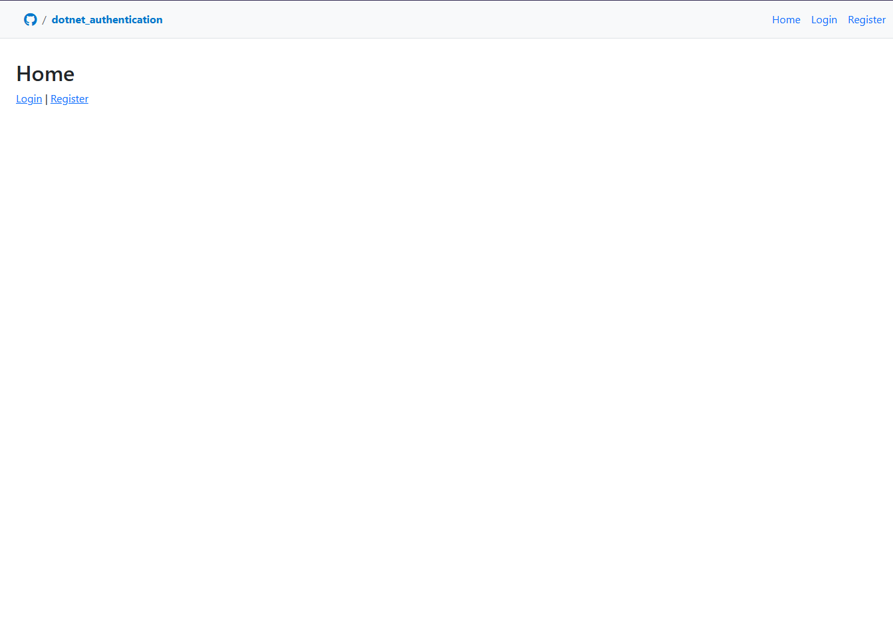
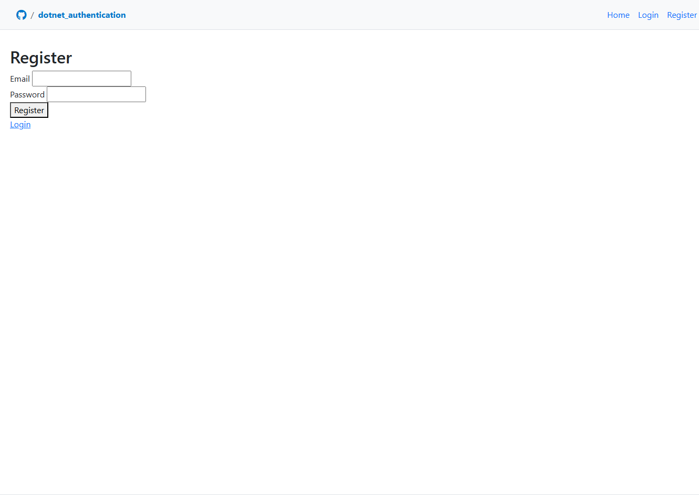
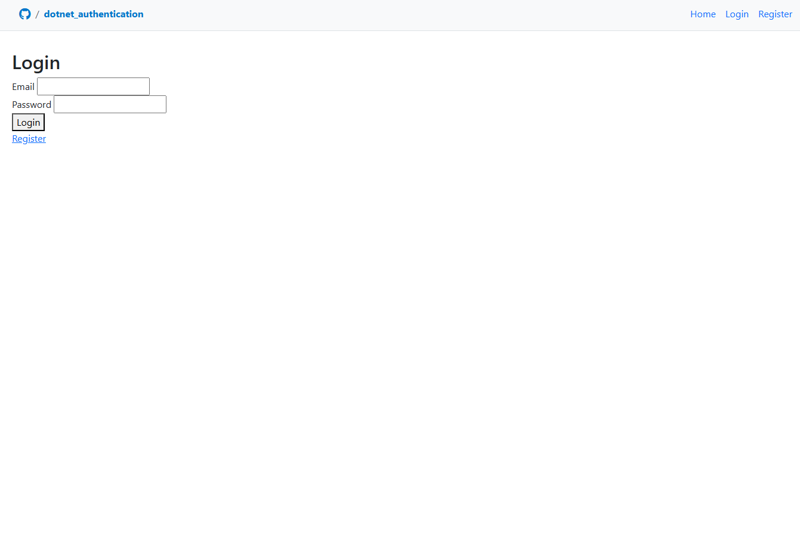
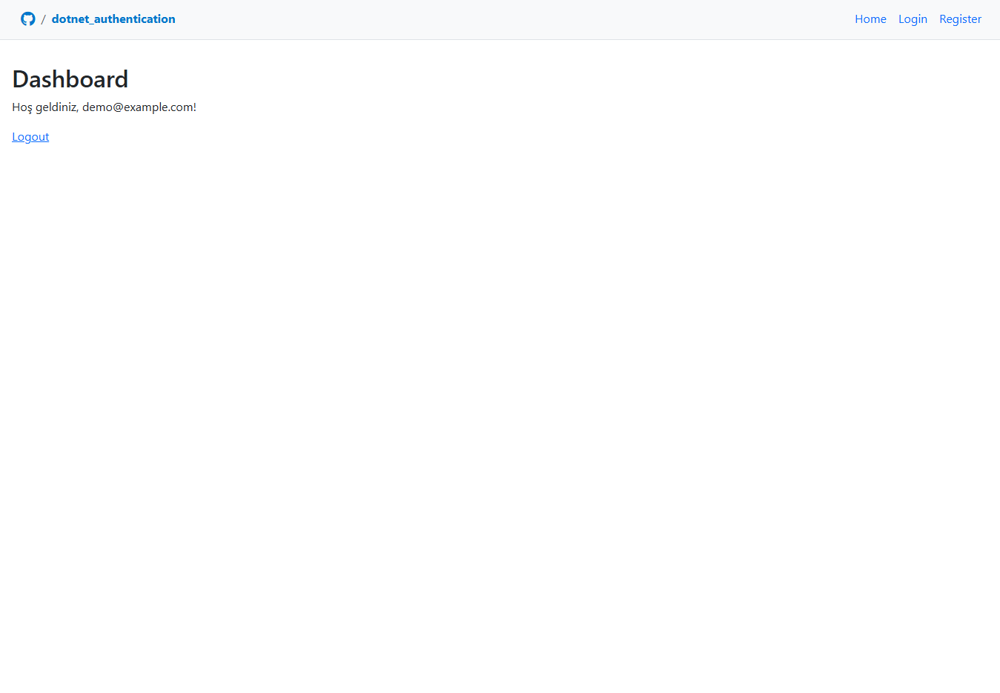

# .NET Authentication

This project is a web application built with .NET 9 and MySQL, providing basic user authentication and authorization features.

## Features

- User registration, login, and logout
- Dashboard page is protected from unauthorized access
- User management with Entity Framework Core and MySQL
- Advanced validation and error messages
- Routing:
  - `/` → Home page
  - `/Account/Login` → Login
  - `/Account/Register` → Register
  - `/Dashboard` → User dashboard

## Screenshots

| Home                          | Register                              | Login                           | Dashboard                               |
| ----------------------------- | ------------------------------------- | ------------------------------- | --------------------------------------- |
|  |  |  |  |

## Setup

1. Install dependencies:
   ```sh
   dotnet restore
   ```
2. Update your MySQL connection string in `appsettings.json`.
3. Run migrations and create the database:
   ```sh
   dotnet ef database update
   ```
4. Start the application:
   ```sh
   dotnet watch run
   ```
